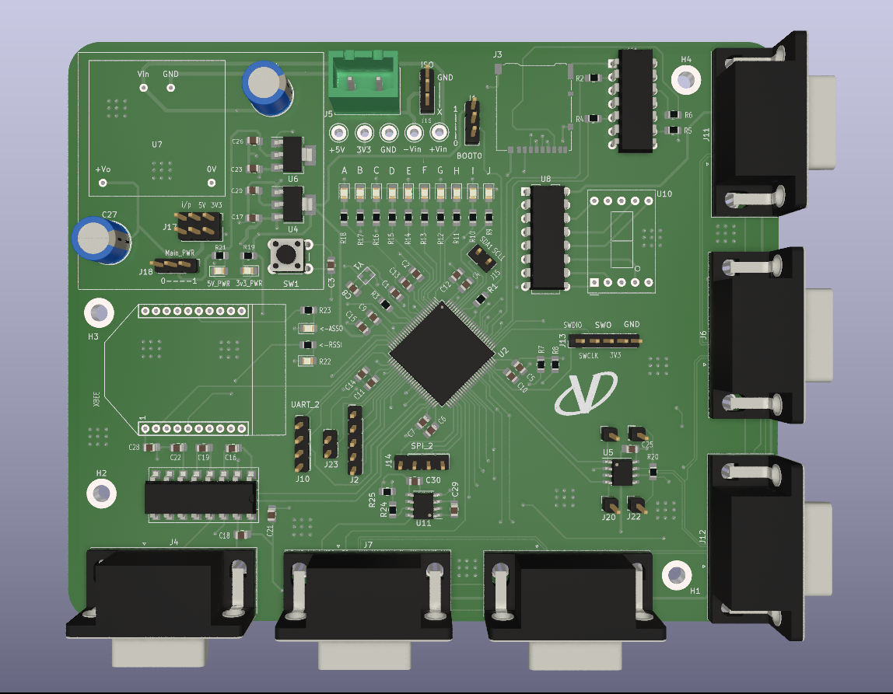

# PCB Design Files

## Projects
- [About](#About)
- [STM32F407 MVCU](#STM32F407-MVCU)
- [STM32F103 VCU](#STM32F103-VCU)
- [STM32F103 Inverter VCU](#STM32F103-Inverter-VCU)
- [STM32F103 Test board](#STM32F103-Test-board)

## About 
This repo contains the PCB files designed by [@Vaaarad07](https://github.com/Vaaarad07).
All of the designs are completely produced in KiCad 6, and each project directory contains the respective  KiCad schematic and layout files. All of the PCB projects are manufactured and tested for their respective functionalities.
I am open for any kind of feedback, suggestion or discussion.

## STM32F407-MVCU
This is a custom made ***4-layer*** board using ***STM32F407*** which is a part of a vehicle control system as the Master control Unit. The board connects to 5 separate vehicle control unit boards using DB9 cables and connectors over ***CAN bus***,which are responsible for handling their sub-system specific functions.
### Following are some of the features of the board : 
- 9-36V input power supply, which is divided into 2 separate buses of 5V and 3.3V respectively using power regulators
- 5 DB9 ports to connect the VCUs with CAN bus connections along with reserved GPIOs.
- DB9 port with RS232 to serial converter to connect an INS,[Pollux 2](https://aeronsystems.com/ins/pollux-2/) 
- On-board RF-transceiver mount.
- 7-segment display
- SD Card slot
- 5-pin Debugger/programmer headers.
- Hardware reset.
- ***UART, SPI, ADC, DAC, I2C*** Connections
- 10 user LEDs with power-on LEDs.

## STM32F103-VCU
This is a custom made 2-Layer board using 
***STM32F103*** which is a part of a vehicle control system as a vehicle control Unit. The board connects to the Master vehicle control unit using DB9 cable and connector over ***CAN bus*** 
### Following are some of the features of the board : 
- Powered through either the Master control unit (5V) or from on-board power input (7-36V) which is further divided into two separate buses of 5V and 3.3V respectively.
- Connects to the Master control unit over CAN bus and reserved GPIOs.
- 4-pin debugger/programmer header.
- 5 user LEDs
- Hardware reset
- ***UART, SPI, I2C, ADC*** ports.

![[VCU.png]]

## STM32F103-Inverter-VCU
This is a custom made 2-Layer board using 
***STM32F103*** which is a part of a vehicle control system as a vehicle control Unit responsible for control of the ***inverter sub-system***. The board connects to the Master vehicle control unit using DB9 cable and connector over ***CAN bus*** 
### Following are some of the features of the board : 
- Powered through either the Master control unit (5V) or from on-board power input (7-36V) which is further divided into two separate buses of 5V and 3.3V respectively.
- Connects to the Master control unit over CAN bus and reserved GPIOs.
- PWM headers connecting to the inverter driver circuit.
- 4-pin debugger/programmer header.
- Hardware reset.
- ***UART, SPI, I2C, ADC*** ports.

![[inverter_vcu.png]]

## STM32F103-Test-board
This is a custom made 2-Layer board using the ***STM32F103*** for testing procedures of various peripherals of the controller and verification of the designed architecture of a vehicle control system.
### Following are some of the features of the board :
- Powered through either the DB9 connector(5V) or the on-board power input (7-36V) which is further divided into two separate buses of 5V and 3.3V respectively.
- ***CAN, UART, SPI, I2C, ADC, PWM*** peripheral ports.
- 4-pin debugger/programmer header.
- 7-segment display
- Hardware reset.

![[f103_V2.png]]
